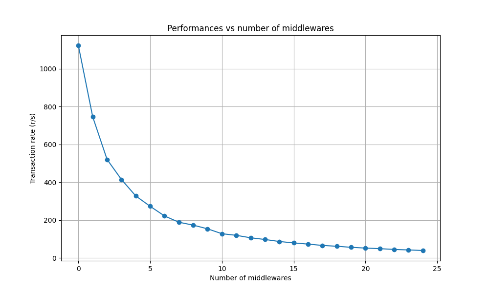

# Performance test suite for Starlette

This project is a test suite trying to detect performance issues when using middlewares.

The middleware is doing nothing. We just test the effect of having empty middlewares.

## Results for Starlette 0.34.0

Test environment : Python 3.12.1, Uvicorn 0.25.0



---- 

## Requirements

- docker
- python 3.10+

```shell
git clone https://github.com/thomasleveil/test-starlette-middleware-perf.git
cd test-starlette-middleware-perf
pip install -r requirements.txt
```

## Usage

```shell
pytest
```

and be patient

## Configuration

See the top section of [tests/test_perf.py](tests/test_perf.py)

## Hack

- A Docker image is built with the configured version of Starlette, Python and Uvicorn.
  See [Dockerfile](docker/Dockerfile)
- The server implementation is minimal. See [server.py](docker/server.py)
- Performance tests are performed using Siege. See [entrypoint.sh](docker/entrypoint.sh)
- Pytest is used to create and run a docker container with a parametrized number of middlewares.
  See [test_perf.py](tests/test_perf.py)

