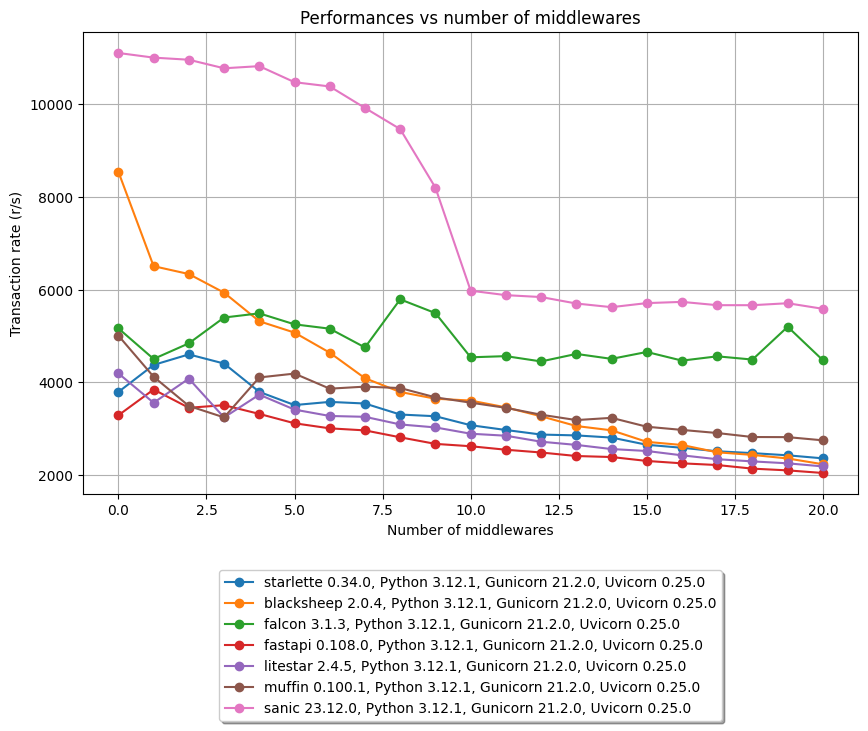

# Performance test suite for ASGI frameworks & middlewares

This project is a test suite showing how performances are affected by the presence of middlewares in popular ASGI 
frameworks.

- The middleware is altering the JSON response body by incrementing a value 
- The middleware implementations try to be as efficient as possible (for instance, implementing a pure middleware 
  in Starlette instead of using BaseHTTPMiddleware)
- The ASGI server stack is a Docker container bound to a single CPU running Gunicorn with 1 Uvicorn worker 
- The performances are measured from [Bombardier](https://github.com/codesenberg/bombardier) running in its own Docker
  container

While the original intent is to show how performances degrade when using many middlewares, this project can easily be
configured to compare performances when using different versions of : 
- Python
- Gunicorn
- Uvicorn
- ASGI frameworks

## Results




---- 

## Requirements

- docker
- python 3.10+

```shell
git clone https://github.com/thomasleveil/test-asgi-middleware-perf.git
cd test-asgi-middleware-perf
pip install -r requirements.txt
```

## Usage

Start the test suite 
```shell
./run_tests.sh
```


## Configuration

See the top section of [tests/config.py](tests/config.py)

## Hack

If you want to modify this test suite, here are a few pointers.

- The whole project is based on [Pytest](https://docs.pytest.org/)
- Performance tests are performed using [Bombardier](https://github.com/codesenberg/bombardier) which is run in its own 
  container. See [docker/bombardier/Dockerfile](docker/bombardier/Dockerfile)
- Pytest is used to create and run a docker container with the parametrized ASGI server configured with a certain number of middlewares.
  See [test_perf.py](tests/test_perf.py)
- Most of the docker heavy lifting is provided by Pytest fixtures : 
  - [`asgi_server_docker_image`](tests/conftest.py) : provide the different ASGI server Docker images (build them if necessary)
  - [`asgi_server`](tests/conftest.py) : provides a ASGI server running on its container
- The [`run_bombardier(url: str)`](utils/bombardier.py) function will start a container running Bombardier and return the Bombardier results
- This test suite will avoid building images twice, so if you happen to modify the Dockerfiles or files that are copied 
  into the Docker images, you will need to manually delete those images from your local Docker registry.
  ```shell
  ./delete_docker_images.sh
  ```
  
